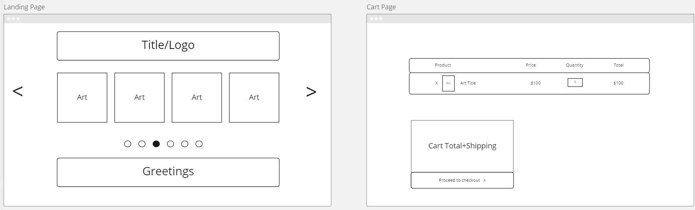
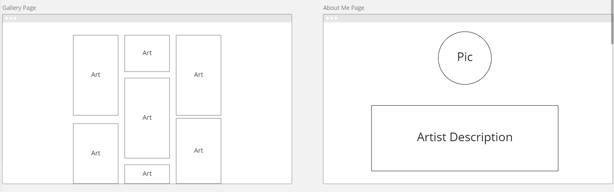

# Gallery

## Description
A website for purchasing a catalog of paintings and requesting custom made to order painting

### Approach Taken
I plan to be using miro to flesh put my Wireframes and a vs code extension called drawio for my Erd's. Im then going to go into this to get the front end done as quickly as possible so the style can be up to review for the person that this project is for. Afterwards then I'll work on all neccessary funcionality like buttons and forms, and then backend api and db's.

### Site owner stories
- As an owner, I would like auth to gain access to edit my art catalog.
- As an owner, I would like to add, update, and delete paintings from the site.
- As an owner, I would like to view and delete request made on the site.
- As an owner, I would like to communicate with requesters via email.
- As an owner, I would like for my site to automaically mark an painting as sold out.

### User stories
- As a user, I would like to view all paintings in the catalog.
- As a user, I would like to request for custom paintings to be made for me.
- As a user, I would like to be able to purchase paintings from the site.
- As a user, I would like to have a reciept of purchase emailed to me.

### Tech
- Typescript
- MERN stack 
- Tailwind

### MVP

- CRUD functionality for paintings
- Auth for owner of site 
- Ability for owner to add paintings to site
- Ability for user to request custom paintings
- Paintings automatically marked as sold out
- Ability for owner to view and delete all request made
- Auth for transactions as transfers
- Notifications sent to owner for request and purchases

## Stretch Goals
- User can review site
- User profiles
- Ability to mark request as 'ready to mail', 'mailed', and 'completed'

### Wireframe

<!-- ### Erd's -->

<!-- ### Restful Routes -->

<!-- ### Sources -->
